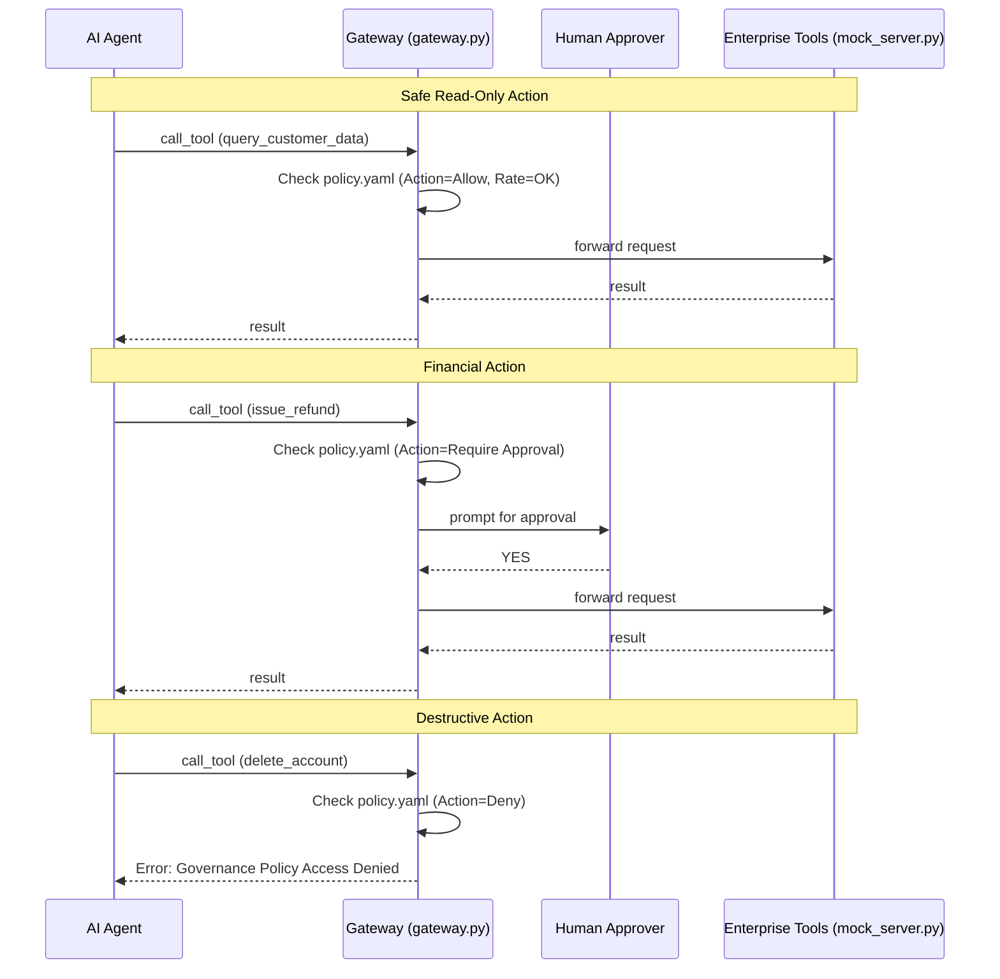

# Experiment 02: Agentic Harness (Governed MCP Gateway)

This experiment demonstrates how to safely connect AI agents to enterprise tools without losing control. It implements an "Agentic Harness" using a proxy pattern over the Model Context Protocol (MCP).

## Why this matters

The fastest way to stall an agent rollout is to give it direct API access to destructive enterprise systems. Security and governance teams will (rightly) block it. 

To bridge the gap, we need an **Agentic Harness**—a gateway that sits between the agent and the tools to enforce rules *outside* the prompt. Prompts can be ignored; infrastructure gateways cannot.

## How it works

This experiment provides a lightweight Python proxy (`gateway.py`) that wraps any MCP server. It intercepts JSON-RPC calls from the agent to the tools and enforces rules defined in `policy.yaml`:

1. **Allow-list & Default Deny:** Only explicitly allowed tools can be called. Unknown or destructive tools are blocked at the network level.
2. **Rate Limiting:** Prevents agents from entering high-speed loops and spamming backend APIs.
3. **Human-in-the-Loop:** For tools with financial or data impact (like `issue_refund`), the harness pauses the execution and waits for human approval (e.g., a CLI prompt, or integrating with Slack/ServiceNow) before passing the request to the tool.
4. **Audit Logging:** Every decision is logged to `audit.jsonl` to provide a clear paper trail of what the agent tried to do, and whether it was allowed.

## Architecture



## Running the Demo locally

### 1. Install dependencies
```bash
pip install -r requirements.txt
```

### 2. Run the Gateway
Start the harness, pointing it to the policy and the mock server:
```bash
python gateway.py policy.yaml python mock_server.py
```

### 3. Send test payloads (Simulating the Agent)
In a separate terminal, pipe a JSON-RPC request into the gateway's stdin to see the governance in action.

**Testing a blocked tool:**
```bash
echo '{"jsonrpc": "2.0", "id": 1, "method": "tools/call", "params": {"name": "delete_account", "arguments": {"customer_id": "123"}}}' | python gateway.py policy.yaml python mock_server.py
```
*Result: The gateway instantly rejects the request without the mock server ever seeing it.*
